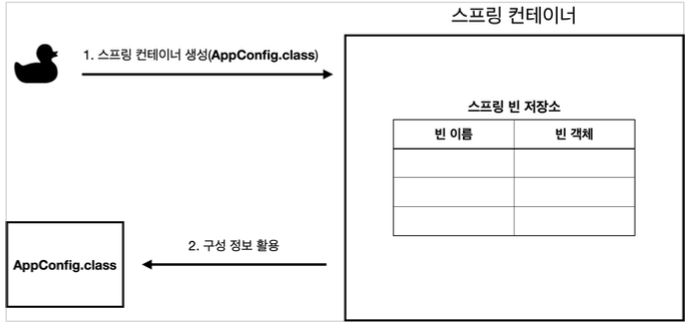
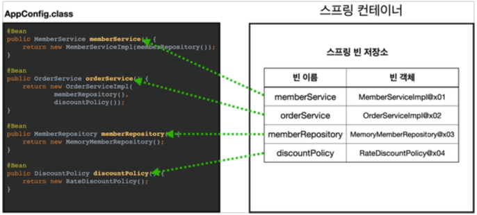
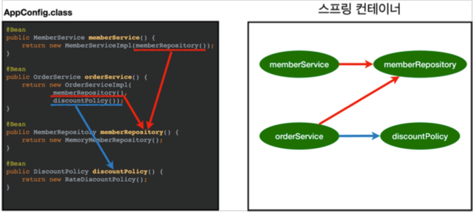
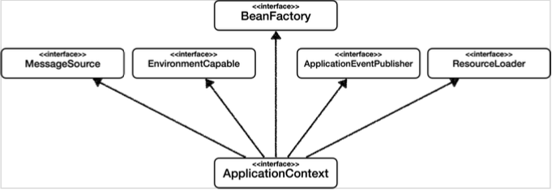
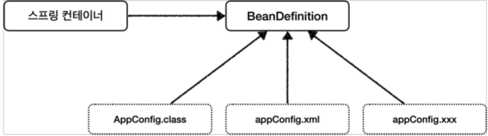
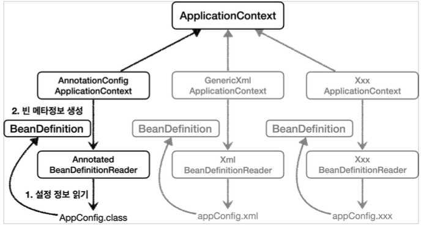

## 스프링 컨테이너와 스프링 빈

### 스프링 컨테이너 생성
스프링 컨테이너가 생성되는 과정을 알아보자.  

```java
// 스프링 컨테이너 생성
ApplicationContext applicationContext = new AnnotationConfigApplicationContext(AppConfig.class);
```

- `ApplicationContext` 를 스프링 컨테이너라 한다.
- `ApplicationContext` 는 인터페이스이다.
- 스프링 컨테이너는 **XML을 기반**으로 만들 수 있고, **애노테이션 기반**의 자바 설정 클래스로 만들 수 있다. 
- 직전에 `AppConfig` 를 사용했던 방식이 애노테이션 기반의 자바 설정 클래스로 스프링 컨테이너를 만든 것이다.
- 자바 설정 클래스를 기반으로 스프링 컨테이너( `ApplicationContext` )를 만들어보자.
  - `new AnnotationConfigApplicationContext(AppConfig.class);` 
  - 이 클래스는 ```ApplicationContext``` 인터페이스의 구현체이다.

> 참고: 더 정확히는 스프링 컨테이너를 부를 때 `BeanFactory` , `ApplicationContext` 로 구분해서 이야기한다. 이 부분은 뒤에서 설명하겠다. ```BeanFactory``` 를 직접 사용하는 경우는 거의 없으므로 일반적으로 `ApplicationContext` 를 스프링 컨테이너라 한다.

### 스프링 컨테이너의 생성 과정
1. 스프링 컨테이너 생성  
- 
- `new AnnotationConfigApplicationContext(AppConfig.class)`
- 스프링 컨테이너를 생성할 때는 구성 정보를 지정해주어야 한다. 
- 여기서는 AppConfig.class 를 구성 정보로 지정했다.  

3. 스프링 빈 등록  
- 
- 스프링 컨테이너는 파라미터로 넘어온 설정 클래스 정보를 사용해서 스프링 빈을 등록한다.
- **빈 이름**
- 빈 이름은 메서드 이름을 사용한다. 빈 이름을 직접 부여할 수 도 있다.
- `@Bean(name="memberService2")`

> **주의: 빈 이름은 항상 다른 이름을 부여**해야 한다.   
> 같은 이름을 부여하면, 다른 빈이 무시되거나, 기존 빈을 덮어버리거나 설정에 따라 오류가 발생한다.

6. 스프링 빈 의존관계 설정 - 준비  
- 
7. 스프링 빈 의존관계 설정 - 완료  
-   
- 스프링 컨테이너는 설정 정보를 참고해서 의존관계를 주입(DI)한다.
- 단순히 자바 코드를 호출하는 것 같지만, 차이가 있다. 이 차이는 뒤에 싱글톤 컨테이너에서 설명한다.

> 참고 스프링은 빈을 생성하고, 의존관계를 주입하는 단계가 나누어져 있다. 그런데 이렇게 자바 코드로 스프링 빈을 등록하면 생성자를 호출하면서 의존관계 주입도 한번에 처리된다. 여기서는 이해를 돕기 위해 개념적으로 나누어 설명했다. 자세한 내용은 의존관계 자동 주입에서 다시 설명하겠다.

### BeanFactory 와 ApplicationContext

BeanFactory
- 스프링 컨테이너의 최상위 인터페이스다.
- 스프링 빈을 관리하고 조회하는 역할을 담당한다.
- `getBean()` 을 제공한다.
- 지금까지 우리가 사용했던 대부분의 기능은 BeanFactory 가 제공하는 기능이다.

ApplicationContext
- BeanFactory 기능을 모두 상속받아서 제공한다.
- 빈을 관리하고 검색하는 기능을 BeanFactory가 제공해주는데, 그러면 둘의 차이가 뭘까? 
- 애플리케이션을 개발할 때는 빈은 관리하고 조회하는 기능은 물론이고, 수 많은 부가기능이 필요하다.  

`ApplicatonContext` 가 제공하는 부가기능  
  
- 메시지소스를 활용한 국제화 기능
  - 예를 들어서 한국에서 들어오면 한국어로, 영어권에서 들어오면 영어로 출력 
- 환경변수
  - 로컬, 개발, 운영등을 구분해서 처리 
- 애플리케이션 이벤트
  - 이벤트를 발행하고 구독하는 모델을 편리하게 지원
- 편리한 리소스 조회
  - 파일, 클래스패스, 외부 등에서 리소스를 편리하게 조회 

**정리**
- ApplicationContext 는 BeanFactory 의 기능을 상속받는다.
- ApplicationContext 는 빈 관리기능 + 편리한 부가 기능을 제공한다.
- BeanFactory 를 직접 사용할 일은 거의 없다. 부가기능이 포함된 ApplicationContext 를 사용한다. 
- BeanFactory 나 ApplicationContext 를 스프링 컨테이너라 한다.

### 스프링 빈 설정 메타 정보 - BeanDefinition
- 스프링은 어떻게 이런 다양한 설정 형식을 지원하는 것일까? 그 중심에는 BeanDefinition 이라는 추상화가 있다.
- 쉽게 이야기해서 **역할과 구현을 개념적으로 나눈 것**이다!
  - XML을 읽어서 BeanDefinition 을 만들면 된다.
  - 자바 코드를 읽어서 BeanDefinition 을 만들면 된다.
  - 스프링 컨테이너는 자바 코드인지, XML 인지 몰라도 된다. 오직 BeanDefinition 만 알면 된다.
- `BeanDefinition` 을 빈 설정 메타정보라 한다.
  - `@Bean` , `<bean>` 당 각각 하나씩 메타 정보가 생성된다.
- 스프링 컨테이너는 이 메타정보를 기반으로 스프링 빈을 생성한다.  
  -   
  - 
  - AnnotationConfigApplicationContext 는 AnnotatedBeanDefinitionReader 를 사용해서 AppConfig.class 를 읽고 BeanDefinition 을 생성한다.
  - GenericXmlApplicationContext 는 XmlBeanDefinitionReader 를 사용해서 appConfig.xml 설정 정보를 읽고 BeanDefinition 을 생성한다.
  - 새로운 형식의 설정 정보가 추가되면, XxxBeanDefinitionReader를 만들어서 BeanDefinition 을 생성하면 된다.

**BeanDefinition 정보**
- BeanClassName: 생성할 빈의 클래스 명(자바 설정 처럼 팩토리 역할의 빈을 사용하면 없음) 
- factoryBeanName: 팩토리 역할의 빈을 사용할 경우 이름, 예) appConfig 
- factoryMethodName: 빈을 생성할 팩토리 메서드 지정, 예) memberService
- Scope: 싱글톤(기본값)
- lazyInit: 스프링 컨테이너를 생성할 때 빈을 생성하는 것이 아니라, 실제 빈을 사용할 때 까지 최대한 생성을 지연처리 하는지 여부
- InitMethodName: 빈을 생성하고, 의존관계를 적용한 뒤에 호출되는 초기화 메서드 명 
- DestroyMethodName: 빈의 생명주기가 끝나서 제거하기 직전에 호출되는 메서드 명 
- Constructor arguments, Properties: 의존관계 주입에서 사용한다. (자바 설정 처럼 팩토리 역할의 빈을 사용하면 없음)

```java
public class BeanDefinitionTest {

    AnnotationConfigApplicationContext ac = new AnnotationConfigApplicationContext(AppConfig.class);

    @Test
    @DisplayName("빈 설정 메타정보 확인")
    void findApplicationBean() {
        String[] beanDefinitionNames = ac.getBeanDefinitionNames();
        for (String beanDefinitionName : beanDefinitionNames) {
            BeanDefinition beanDefinition =
                    ac.getBeanDefinition(beanDefinitionName);
            if (beanDefinition.getRole() == BeanDefinition.ROLE_APPLICATION) {
                System.out.println("beanDefinitionName" + beanDefinitionName + " beanDefinition = " + beanDefinition);
            }
        }
    }
}
```

**정리**
- BeanDefinition 을 직접 생성해서 스프링 컨테이너에 등록할 수 도 있다. 하지만 실무에서 BeanDefinition 을 직접 정의하거나 사용할 일은 거의 없다. 
어려우면 그냥 넘어가면 된다^^!
- BeanDefinition 에 대해서는 너무 깊이있게 이해하기 보다는, 
스프링이 다양한 형태의 설정 정보를 BeanDefinition 으로 추상화해서 사용하는 것 정도만 이해하면 된다.
- 가끔 스프링 코드나 스프링 관련 오픈 소스의 코드를 볼 때, BeanDefinition 이라는 것이 보일 때가 있다. 이때 이러한 메커니즘을 떠올리면 된다.

